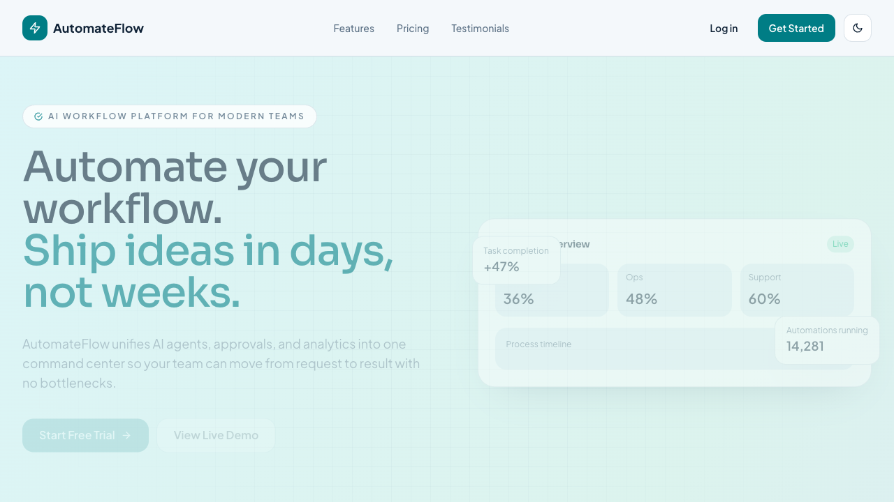
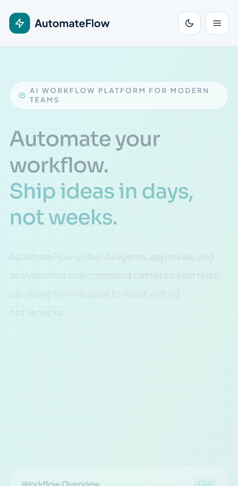

# AutomateFlow - Startup Landing Page

A modern SaaS-style startup landing page built with React, Tailwind CSS, and Framer Motion.

This project is designed as a portfolio-grade 2026 frontend showcase with polished visuals, responsive layout behavior, smooth motion, and dark mode support.

## Tech Stack

- React (Vite)
- Tailwind CSS
- Framer Motion
- React Icons
- clsx

## Features

- Mobile-first responsive design (320px to 1440px+)
- Sticky navigation with backdrop blur
- Dark mode toggle with:
  - Local preference persistence (`localStorage`)
  - System preference support (`prefers-color-scheme`)
- Hero section with animated gradient and floating UI stats
- 6 animated feature cards with hover interactions
- Product dashboard preview (sidebar, analytics cards, chart, table)
- Pricing section with highlighted recommended plan
- Testimonial grid with clean card layout
- CTA band with gradient background and micro-interactions
- Accessible semantic HTML and keyboard-friendly controls

## Project Structure

```text
src
  components
    Navbar.jsx
    Hero.jsx
    Features.jsx
    ProductPreview.jsx
    Pricing.jsx
    Testimonials.jsx
    CTA.jsx
    Footer.jsx
  components/ui
    Button.jsx
    Card.jsx
  hooks
    useDarkMode.js
  App.jsx
  main.jsx
```

## Screenshots

Desktop:



Mobile:



## Run Locally

```bash
cd /Users/nikitaelfutin/projects/portfolio/Startup_Landing_Page
npm install
npm run dev
```

Open the local URL shown in terminal (default: `http://localhost:5173`).

## Build for Production

```bash
npm run build
npm run preview
```
