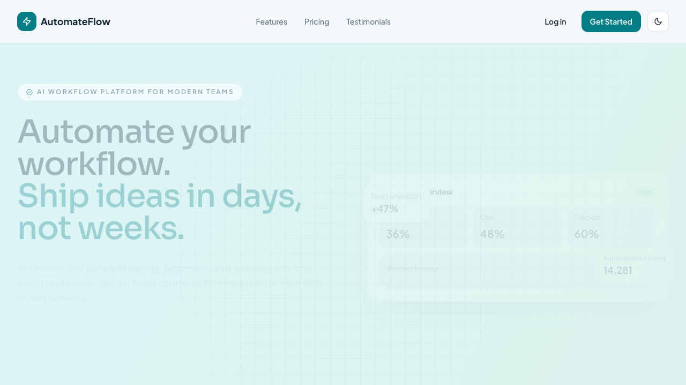
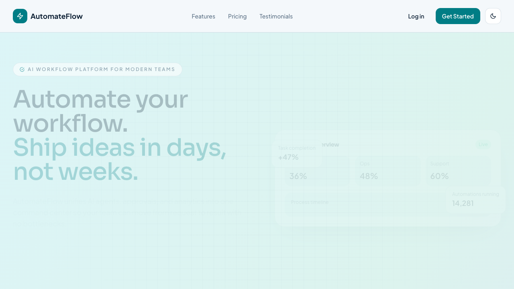
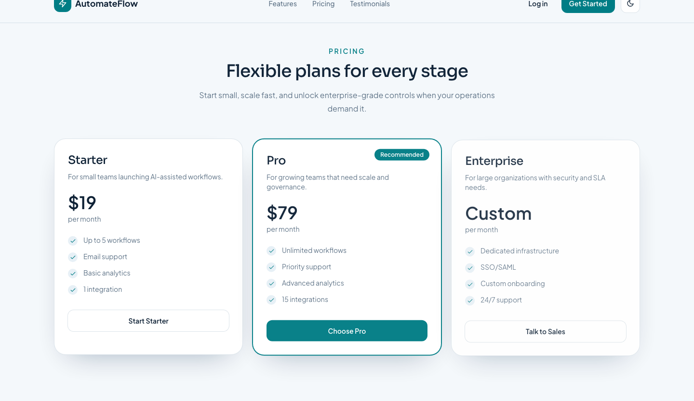
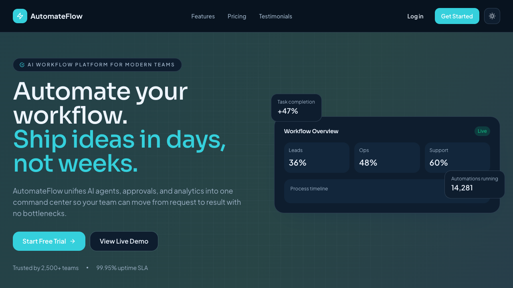
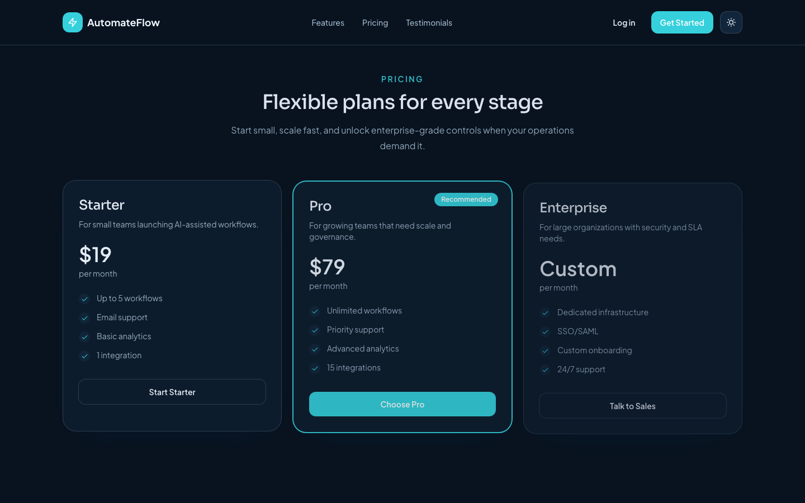

# PromptFlow AI — Modern SaaS Startup Landing Page

> A modern animated SaaS landing page built with React and Tailwind CSS.

A modern SaaS-style landing page for a fictional startup. Built with React and Tailwind CSS, featuring responsive design, smooth animations, and dark mode support.

## Live Demo (github pages):

[https://nikotheabstract.github.io/startup-landing-page/](https://nikotheabstract.github.io/startup-landing-page/)

## Screenshots

### Desktop

Hero section



Features section



Pricing section



## Dark Mode





## Mobile Responsive Design


## Animations

Hero animation


Card hover animation


Dark mode toggle animation


Mobile navigation animation


## Features

- Responsive design (mobile / tablet / desktop)
- Dark mode with system preference support
- Animated UI components
- Modern SaaS landing page layout
- Interactive feature cards
- Pricing cards with hover animations
- Mobile navigation menu
- Sticky navigation bar
- Smooth scrolling animations

## Tech Stack

- React
- Vite
- Tailwind CSS
- Framer Motion
- React Icons

## UI Highlights

- Smooth micro-interactions across buttons and cards
- Responsive layout optimized for small to large screens
- Animated components with subtle, modern motion
- Clean SaaS visual language with soft gradients and rounded cards
- Dark mode experience with preference persistence

## Folder Structure

```text
src
  components
    Navbar.jsx
    Hero.jsx
    Features.jsx
    ProductPreview.jsx
    Pricing.jsx
    Testimonials.jsx
    CTA.jsx
    Footer.jsx
  hooks
    useDarkMode.js
  App.jsx
  main.jsx
```

## Installation

```bash
npm install
npm run dev
```

## Author

nikotheabstract
